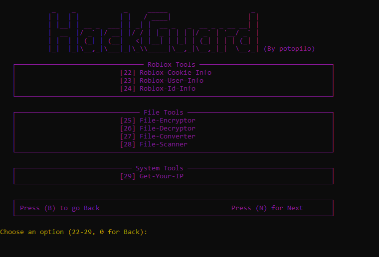
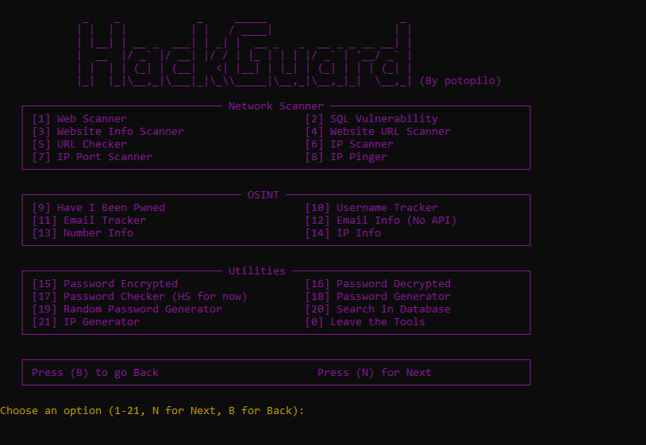

<p>
  <h3 align="center">⭐ HackGuard 1.0 (SOON)!⭐</h3>
</p>

<h1>📜・Description:</h1>

	HackGuard est une boîte à outils polyvalente et puissante, conçue pour améliorer votre productivité en développement, gestion de projets, et sécurité informatique. Développée par potopilo, cette suite d'outils vous offre 29 fonctionnalités différentes pour simplifier vos tâches quotidiennes. Que vous soyez développeur, administrateur système ou un passionné de technologie, HackGuard est votre allié incontournable.

<p align="center">
   
   
</p>
<h1>⭐・Features: </h1>

<p>	
  <h3 align="center">HackGuard vous offre une large gamme de fonctionnalités réparties en différentes catégories :</h3>
</p>


⚙️ Fonctions principales :

⚒️ HackGuard
- Settings
- Tool-Info
- **Tool-Websites (à venir)**

 🕵️‍♂️ Network Scanner
- Sql-Vulnerability
- Website-Info-Scanner
- Website-Url-Scanner
- URL-Checker
- Ip-Scanner
- Ip-Port-Scanner
- Ip-Pinger

 🔎 Osint
- have-i-been-pwned
- Username-Tracker
- Email-Tracker
- Email-Info
- Number-Info
- Ip-Info

🔧 Utilities
- Password-Encrypted
- Password-Decrypted
- Password-Checker
- Password-Generator
- Password-Generator (Random
- Search-In-DataBase
- Ip-Generator

 🎮 Roblox Tools
- Roblox-Cookie-Info
- Roblox-User -Info
- Roblox-Id-Info

🗂️ File Tools
- File-Encryptor
- File-Decryptor
- File-Converter
- File-Scanner

💻 System Tools
- Get-Your-Ip


<h1>・Nouveautés :</h1>

```
-Amélioration de la traduction : Perfectionnement de la traduction et personnalisation du Tool.
-Corrections de tout les bug, et re fonte du menu.
```

<h1>⏳・Installation:</h1>

 <a href="https://github.com/HackGuard-projets/HackGuard.git">Téléchargez "HackGuard" ICI</a>
 
 <p>
  
Or
```
1 - Ouvrez un terminal.
2 - Écrivez git clone https://github.com/HackGuard-projets/HackGuard.git.
3 - Écrivez "cd HackGuard".
4 - Écrivez "python main.py".

(Les modules sont a installer manuelement).
```
</p>

<h1>⚠️・Conditions d'utilisation :</h1>

<p>
	HackGuard a été développé uniquement à des fins éducatives.
        Ne pas utiliser a des fin criminelles ou malveillante !
</p>


<h2>🔗・Credits:</h2>

<p>
  - <a href="https://discord.gg/Tqe2vgrY9p">Discord</a><br>
  - Createur: Potopilo<br>
  - Version: 1.0
</p>
