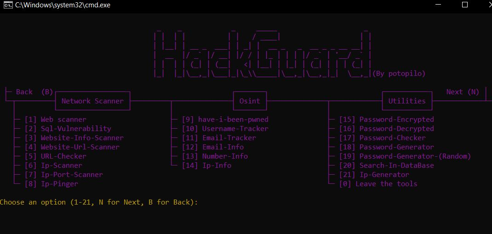

<p>
  <h3 align="center">⭐ HackGuard 1.0 (SOON)!⭐</h3>
</p>

<h1>📜・Description:</h1>

	HackGuard est une boîte à outils polyvalente et puissante, conçue pour améliorer votre productivité en développement, gestion de projets, et sécurité informatique. Développée par potopilo, cette suite d'outils vous offre 29 fonctionnalités différentes pour simplifier vos tâches quotidiennes. Que vous soyez développeur, administrateur système ou un passionné de technologie, HackGuard est votre allié incontournable.

<p>


  👨‍💻 -> Développé en <strong>Python 3.12</strong>.<br>
  🌍 -> Tool en <strong>English</strong>.<br>
  💻 -> Compatible avec <strong>Windows</strong> et bientôt <strong>Linux</strong>.<br>
  🔎 -> Pas de <strong>malware</strong> ni de <strong>backdoor</strong>.<br>
  📂 -> <strong>Open Source</strong> garantissant l'absence de programmes malveillants.<br>
  🔄 -> <strong>Mises à jour fréquentes</strong>.<br>
  💰 -> <strong>Entièrement gratuit</strong> pour tous.<br>
</p>
   
   
<h1>⭐・Features: </h1>

<p>	
  <h3 align="center">HackGuard vous offre une large gamme de fonctionnalités réparties en différentes catégories :</h3>
</p>

```
┌ Paramètres et Informations
│
├ Scan et Vérification
│
├ Informations sur les IP et Réseaux
│
├ Vulnérabilité et Sécurité
│
├ Suivi d'Informations (Osint)
│
├ Gestion des Mots de Passe
│
├ Fonctionnalités Discord
│
├ Fonctionnalités Roblox
│
├ Chiffrement, Décryptage et Conversion de Fichiers
│
├ Téléchargements et Génération de Contenu
│
├ Techniques de Dissimilation et Analyse de Métadonnées
│
└ Divers autres tools
```

<h1>⚙️・Fonctions principales :</h1>

```
┌── ⚒️ - HackGuard
│   ├── Settings
│   ├── Tool-Info
│   └── Tool-Websites(soon)
│
├── 🕵️‍♂️ - Network Scanner
│   ├── Sql-Vulnerability
│   ├── Website-Info-Scanner
│   ├── Website-Url-Scanner
│   ├── URL-Checker
│   ├── Ip-Scanner
│   ├── Ip-Port-Scanner
│   └── Ip-Pinger
│
├── 🔎 - Osint
│   ├── have-i-been-pwned
│   ├── Username-Tracker
│   ├── Email-Tracker
│   ├── Email-Info
│   ├── Number-Info
│   └── Ip-Info
│
├── 🔧 - Utilities
│   ├── Password-Encrypted
│   ├── Password-Decrypted
│   ├── Password-Checker
│   ├── Password-Generator
│   ├── Password-Generator-(Random)
│   ├── Search-In-DataBase
│   └── Ip-Generator
│
├── 🎮 - Roblox Tools
│   ├── Roblox-Cookie-Info
│   ├── Roblox-User-Info
│   └── Roblox-Id-Info
│
├── 🗂️ - File Tools
│   ├── File-Encryptor
│   ├── File-Decryptor
│   ├── File-Converter
│   └── File-Scanner
│
│
└── 💻 - System Tools
    └── Get-Your-Ip


```

<h1>・Nouveautés :</h1>

```
Amélioration de la traduction : Perfectionnement de la traduction et personnalisation du Tool.
Quelques Améliorations supplémentaires.
```

<h1>🔒・Requirements:</h1>

<h3>Windows:</h3>

<p>
- Installez <a href="https://www.python.org/downloads/">Python</a> avec les variables <a href="Img/Python_Path.png">PATH</a> .<br>
- Windows 10 & 11 ou +
</p>

<h1>⏳・Installation:</h1>

 <a href="https://github.com/HackGuard-projets/HackGuard.git">Téléchargez "HackGuard" ICI</a>
 
 <p>
  
```
1 - Téléchargez "HackGuard".zip.
2 - Décompressez le dossier.
3 - Lancez "Setup.bat" ou "Setup.py".
```
Or
```
1 - Ouvrez un terminal.
2 - Écrivez git clone https://github.com/HackGuard-projets/HackGuard.git.
3 - Écrivez "cd HackGuard".
4 - Écrivez "python Setup.py".
```
</p>

<h1>⚠️・Conditions d'utilisation :</h1>

<p>
	HackGuard a été développé uniquement à des fins éducatives. Ce projet a été créé avec de bonnes intentions et est destiné à un usage personnel uniquement. En choisissant d'utiliser HackGuard, vous reconnaissez et acceptez l'entière responsabilité des conséquences pouvant résulter de vos actions.
</p>


<h2>🔗・Credits:</h2>

<p>
  - <a href="https://discord.gg/Tqe2vgrY9p">Discord</a><br>
  - Createur: Potopilo<br>
  - Version: 1.0
</p>
